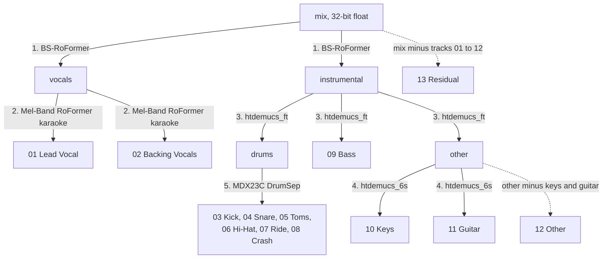

# multitrack

Split a finished song into 13 true-level stems (lead and backing vocals, six drum-kit pieces, bass, keys, guitar, other, residual) that sum back to the original mix.

## Why it exists

Joaquín Jacubowicz is a musician and producer who studies reference tracks: how loud the kick sits against the bass, what the backing vocals are doing, how a guitar part is voiced. That is easiest with the song as a multitrack, with every part soloable at its real level in the mix.

A single source-separation model gives four to six stems, and audio-separator, the wrapper used here, by default scales each stem down on its own, so the stems no longer add up to the song and their relative levels are lost. `multitrack` chains five models, each working on one part of the previous model's output, keeps every intermediate at its true level, and adds a residual track so the set sums back to the mix exactly.

## How it works



| Stage | Model | Input | Output used |
|---|---|---|---|
| 1 | BS-RoFormer (`model_bs_roformer_ep_317_sdr_12.9755`) | mix | vocals, instrumental |
| 2 | Mel-Band RoFormer karaoke (`mel_band_roformer_karaoke_aufr33_viperx_sdr_10.1956`) | vocals | lead vocal, backing vocals |
| 3 | Demucs v4 `htdemucs_ft` | instrumental | drums, bass, other |
| 4 | Demucs v4 `htdemucs_6s` | other | piano (as Keys), guitar |
| 5 | MDX23C DrumSep (`MDX23C-DrumSep-aufr33-jarredou`) | drums | kick, snare, toms, hi-hat, ride, crash |

Why this order: vocals come out first, with a dedicated vocal model (the author's choice for the cleanest vocal split), so the later models only see the instrumental. htdemucs_ft, the fine-tuned Demucs v4, splits that into drums, bass and other. htdemucs_6s is used only for its piano and guitar sources, and only on the "other" stem. DrumSep expects an isolated drum track as input.

### True level

[audio-separator](https://github.com/karaokenerds/python-audio-separator), which runs all five models, scales the input and each output stem down independently whenever its peak exceeds 0.9 (its default `--normalization`), and writes 16-bit files. Each stem then has its own unknown gain, so the stems no longer sum to the input, and a stage fed with a rescaled stem passes that error on.

Every stage therefore goes through the bundled `stems -t`:

1. decode the input to 32-bit float and halve it (−6 dB; a power-of-two scale, exact in floating point),
2. run audio-separator with `--normalization 1.0` and float output, so nothing below the ceiling is rescaled,
3. double every stem back,
4. refuse a stem that reached the 1.0 ceiling, because that means it was rescaled.

The stems are written as 32-bit float WAV because a stem can peak above 0 dBFS even when the mix does not: parts partly cancel each other in the mix.

### Assembly and the residual

`assemble.py` collects the stage outputs into numbered files:

- As a safety check it fits the stage-1 vocals and instrumental to the mix by least squares and scales every stem cascaded from stage 1 by those gains. With true-level stems both gains are within 1% of 1; a larger deviation, which would mean audio-separator rescaled them, is reported as a correction.
- `12 Other` is the "other" stem minus the keys and guitar, because htdemucs_6s run on an "other"-only input does not sum back to it.
- `13 Residual` is the mix minus tracks 01 to 12. By construction the 13 files sum to the mix (up to floating-point rounding). The residual holds whatever the models dropped, for example drum content DrumSep assigned to none of its six pieces, or the vocal stem htdemucs_ft still finds in the instrumental.

The printed null test reports each stem's RMS level relative to the mix, its peak, and how far below the mix the residual sits. A residual far below the mix means the 12 named stems account for almost all of it.

Stages are resumable: a stage whose folder already has stems is skipped, so a crashed run continues where it stopped.

## Requirements

Tested on macOS (Apple Silicon, M3 Pro); `readlink -f` needs macOS 12.3 or later. Linux is untested (the macOS Finder-flag cleanup is skipped there). Windows is not supported.

- **[audio-separator](https://github.com/karaokenerds/python-audio-separator)**. The author installs it with `uv tool install "audio-separator[cpu]" --with audioread --python 3.12` (`[gpu]` for CUDA).
- **A Python with numpy and soundfile** for `assemble.py` and for the gain steps in `stems -t`. By default the scripts use the Python of the `uv tool` environment of audio-separator (`~/.local/share/uv/tools/audio-separator/bin/python`), which already has both; otherwise `python3`, or set `AUDIO_SEPARATOR_PYTHON`.
- **ffmpeg** on PATH.
- bash.

### Models

audio-separator downloads each model on first use into `~/audio-separator-models` (or `$STEMS_MODEL_DIR`), from the URLs in its model registry: the Demucs weights from Meta's `dl.fbaipublicfiles.com` (htdemucs_ft is 4 files of about 84 MB), the other checkpoints and their configs from GitHub releases of the Ultimate Vocal Remover model repository and of audio-separator. Nothing is downloaded by this repository's own code.

## Install

```bash
git clone <this repo> multitrack
mkdir -p ~/.local/bin
uv tool install "audio-separator[cpu]" --with audioread --python 3.12
brew install ffmpeg                     # macOS
ln -s "$PWD/multitrack/multitrack.sh" ~/.local/bin/multitrack
```

`multitrack.sh` finds the `stems` script next to itself (it resolves the symlink), so `stems` does not need to be on PATH.

## Usage

```bash
multitrack song.wav                    # -> ./Transcriptions/song Stems/
multitrack -o ~/Desktop/song-stems song.flac
multitrack -k song.mp3                 # keep _work/ with every intermediate stem
```

Any format ffmpeg can read works; the first audio stream is used and resampled to 44.1 kHz. A run takes about 5 times the song's length on an M3 Pro (a 4-minute song takes about 20 minutes).

| Variable | Default | Meaning |
|---|---|---|
| `TRANSCRIPTIONS_DIR` | `./Transcriptions` | parent folder for `<name> Stems/` (`-o` overrides it) |
| `STEMS_CMD` | the `stems` script next to `multitrack.sh`, else PATH | separation helper |
| `AUDIO_SEPARATOR_PYTHON` | audio-separator's `uv tool` Python, else `python3` | Python with numpy and soundfile |
| `STEMS_MODEL_DIR` | `~/audio-separator-models` | model cache |
| `AUDIO_SEPARATOR` | `~/.local/bin/audio-separator`, else PATH | audio-separator CLI |

`stems` also works on its own (`stems -h`): short model names (`ft`, `6s`, `rofo`, `dual`, `mdx23c`, or any model filename), folder input, FLAC or WAV output, and `-t` for true level. The same script is included in the companion repository [`transcribe-midi`](https://github.com/heiofdvk/transcribe-midi), which turns links or audio files into MIDI; the two copies are identical.

## Output

```
<name> Stems/
    01 Lead Vocal.wav
    02 Backing Vocals.wav
    03 Kick.wav
    04 Snare.wav
    05 Toms.wav
    06 Hi-Hat.wav
    07 Ride.wav
    08 Crash.wav
    09 Bass.wav
    10 Keys.wav
    11 Guitar.wav
    12 Other.wav
    13 Residual.wav
    _work/              intermediate stems, only with -k
```

All files are 32-bit float WAV at 44.1 kHz (the input is resampled to 44.1 kHz first, the rate audio-separator works at), the same length as the mix, and line up sample for sample, so they can be dropped into a DAW at 0 dB and played together to reproduce the song.

## Limitations

- Separation quality is bounded by the models. Expect bleed between stems, especially between keys, guitar and other. The Demucs authors note that the htdemucs_6s piano source does not work well.
- The lead/backing split depends on the karaoke model; doubles and harmonies can land in either track.
- The residual is not silence. It is where everything the models did not assign ends up, so check it before assuming a part is missing.
- Slow and CPU/GPU-heavy, and `_work/` holds every intermediate stem while the run is going.
- Stems of commercial recordings are for personal study and should not be redistributed.

## Credits and licences

The tools and models this repository calls have their own licences:

| Component | Role | Licence |
|---|---|---|
| [audio-separator](https://github.com/karaokenerds/python-audio-separator) | runs all five models | MIT |
| [Ultimate Vocal Remover](https://github.com/Anjok07/ultimatevocalremovergui) (Anjok07, aufr33) | model repository and most of audio-separator's code | MIT; audio-separator asks users of UVR models to credit UVR and its developers |
| [Demucs](https://github.com/facebookresearch/demucs) v4, htdemucs_ft and htdemucs_6s (Meta) | stages 3 and 4 | MIT |
| BS-RoFormer checkpoint by viperx | stage 1 | no licence stated in audio-separator's model registry; not verified |
| Mel-Band RoFormer karaoke checkpoint by aufr33 and viperx | stage 2 | no licence stated in audio-separator's model registry; not verified |
| MDX23C DrumSep checkpoint by aufr33 and jarredou | stage 5 | no licence stated in audio-separator's model registry; not verified |
| [FFmpeg](https://ffmpeg.org) | decoding to float | LGPL 2.1+ or GPL depending on the build; called as an external program |
| [NumPy](https://numpy.org), [python-soundfile](https://github.com/bastibe/python-soundfile) | assembly, gain steps | BSD 3-Clause |

Papers:

- Simon Rouard, Francisco Massa and Alexandre Défossez, "Hybrid Transformers for Music Source Separation", ICASSP 2023 (htdemucs).
- "Music Source Separation with Band-Split RoPE Transformer" (BS-RoFormer), ByteDance, 2023.
- "Mel-Band RoFormer for Music Source Separation", ByteDance, 2023.

---

Written by Joaquín Jacubowicz. Built with [Claude Code](https://claude.com/claude-code): the author designed the tool, directed the agent and tested the results.
